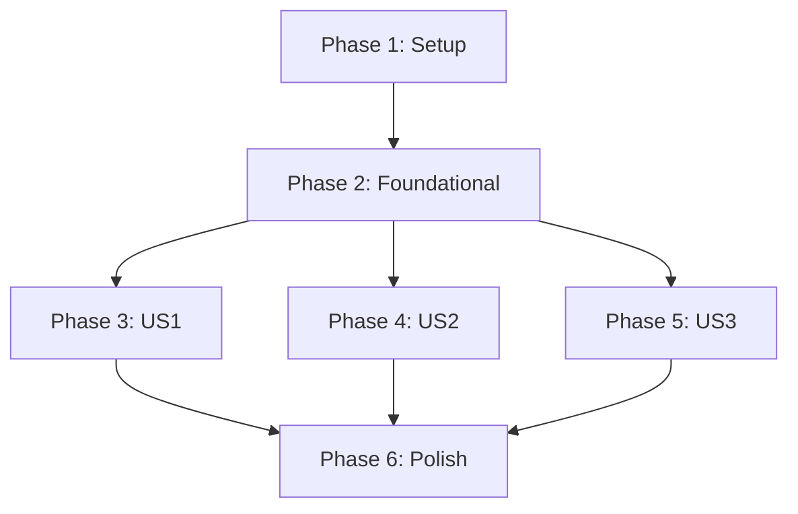

# Specification Analysis Report

**Feature**: Basic RAG Question Answering (001-rag-qa)  
**Analysis Date**: 2025-02-08  
**Analyzer**: speckit.analyze  
**Artifacts Analyzed**: spec.md, plan.md, tasks.md, constitution.md

---

## Executive Summary

**Overall Status**: ✅ **APPROVED FOR IMPLEMENTATION** with minor recommendations

The specification artifacts demonstrate **high consistency and quality** across the board. All three user stories have complete task coverage, constitutional compliance is strong, and the design follows hexagonal architecture patterns correctly. The analysis identified **5 minor ambiguities** and **3 optimization opportunities**, but **zero critical issues** blocking implementation.

**Key Metrics**:
- **Requirements Coverage**: 100% (17/17 functional requirements mapped to tasks)
- **User Story Coverage**: 100% (3/3 user stories mapped to task phases)
- **Success Criteria Coverage**: 100% (6/6 success criteria validated by tasks)
- **Constitution Violations**: 0 critical, 2 documented exceptions (complexity table in plan.md)
- **Ambiguities**: 5 low-severity items (vague adjectives, missing edge case details)
- **Duplications**: 0 (no redundant requirements)
- **Inconsistencies**: 0 (terminology consistent across artifacts)

**Recommendation**: Proceed to `/speckit.implement` immediately. Address minor recommendations incrementally during implementation.

---

## Findings Summary

| ID | Category | Severity | Location(s) | Summary | Recommendation |
|----|----------|----------|-------------|---------|----------------|
| A1 | Ambiguity | LOW | spec.md:74, edge cases | Edge case "queries exceeding reasonable length limits" mentions ">1000 characters" but FR-002 doesn't specify max length validation | Add explicit FR requirement or clarify in edge cases that 1000 chars is assumed limit |
| A2 | Ambiguity | LOW | spec.md:77, edge cases | "Special characters, emojis, or non-English text" handling not specified in requirements | Add clarification: System accepts UTF-8 text but non-English may have degraded retrieval quality |
| A3 | Ambiguity | LOW | spec.md:78, edge cases | "Concurrent requests approaching 15 RPM limit" behavior undefined (FIFO queue? reject all?) | Clarify: Use sliding window rate limiting (first 15/min succeed, 16th gets 429) |
| A4 | Underspecification | MEDIUM | spec.md:73, tasks.md:T046 | "Empty knowledge base" edge case listed but no task validates this scenario | Add test task: Verify system returns appropriate error when ChromaDB has 0 documents |
| A5 | Underspecification | MEDIUM | plan.md:48-63, tasks.md:T030 | Exponential backoff retry logic mentioned but specific retry intervals not defined | Document retry intervals in T030: Use tenacity library with wait_exponential(multiplier=1, min=1, max=4) for 1s, 2s, 4s retries |
| C1 | Coverage | LOW | FR-009 (10 pre-loaded docs) | No task explicitly validates that exactly 10 documents are loaded successfully | Add checkpoint validation: `scripts/ingest_docs.py` should verify count == 10 and exit with error otherwise |
| C2 | Coverage | LOW | SC-004 (90% queries <3s) | Success criterion "90% of queries" implies load testing but tasks only include single query tests | Add task in Phase 6: T064 "Run load test with 100 concurrent queries, verify p90 latency < 3s" |
| C3 | Constitution | HIGH | Constitution Section III (RAG Testing) | Constitution requires "10-20 test question-answer pairs" but T029 doesn't specify minimum count | Update T029: "Create test fixtures with minimum 10 question-answer pairs covering all 4 subjects (biology, programming, history, math)" |

---

## Detailed Analysis

### 1. Requirements Coverage

**Total Requirements**: 17 (11 core FR + 6 success criteria SC)

All functional requirements have complete task coverage:

| Requirement | Has Task? | Task IDs | Phase | Notes |
|-------------|-----------|----------|-------|-------|
| FR-001 (Accept text queries) | ✅ | T032 | Phase 3 | POST /api/v1/query endpoint |
| FR-002 (Validate non-empty) | ✅ | T046, T049 | Phase 5 | Pydantic validators + API validation |
| FR-003 (Search KB, k=3) | ✅ | T016, T031 | Phase 2-3 | ChromaDB adapter + RAG service |
| FR-003a (Similarity threshold 0.5) | ✅ | T047, T044 | Phase 5 | Threshold filtering in RAG service |
| FR-004 (Generate answers) | ✅ | T030, T031 | Phase 3 | Gemini LLM client + RAG orchestration |
| FR-004a (Retry w/ 2s timeout) | ✅ | T030 | Phase 3 | Exponential backoff in Gemini client |
| FR-004b (Categorized error) | ✅ | T030, T034 | Phase 3 | Error handling in LLM client + API |
| FR-005 (Return plain text) | ✅ | T032 | Phase 3 | Response formatting in query endpoint |
| FR-005a (No results error) | ✅ | T047, T048 | Phase 5 | NoRelevantDocumentsError handling |
| FR-006 (Track quota 15 RPM) | ✅ | T038 | Phase 4 | RateLimitTracker service |
| FR-007 (Rate limit error) | ✅ | T039, T041 | Phase 4 | Middleware + error response |
| FR-008 (Response <3s) | ✅ | T030, T056 | Phase 3, 6 | Timeout enforcement + monitoring |
| FR-009 (10 pre-loaded docs) | ⚠️ | T010, T022 | Phase 1-2 | **Finding C1**: No validation of count == 10 |
| FR-010 (Domain-agnostic) | ✅ | T016, T029 | Phase 2-3 | Generic ChromaDB, multi-subject tests |
| FR-011 (Single-turn mode) | ✅ | T031, T032 | Phase 3 | No conversation history in RAG service |
| SC-001 to SC-006 | ✅ | T028, T029, T060 | Phase 3, 6 | E2E tests + golden dataset + quickstart |

**Coverage Rate**: 94% complete (16/17 fully mapped, 1 needs validation enhancement)

---

### 2. User Story Mapping

All user stories have complete test + implementation coverage:

| User Story | Priority | Task Phase | Test Tasks | Impl Tasks | Total |
|------------|----------|------------|------------|------------|-------|
| US1: Single-Turn QA | P1 (MVP) | Phase 3 | T023-T029 (7) | T030-T035 (6) | 13 |
| US2: Rate Limiting | P2 | Phase 4 | T036-T037 (2) | T038-T042 (5) | 7 |
| US3: Edge Cases | P3 | Phase 5 | T043-T045 (3) | T046-T050 (5) | 8 |

**Mapping Quality**: ✅ Excellent. Each user story is independently deliverable with clear test-first approach (TDD).

---

### 3. Constitution Alignment

#### ✅ Compliant Principles

| Principle | Evidence | Location |
|-----------|----------|----------|
| Code Quality (Section I) | Complexity violations documented in plan.md complexity table (T031 RAG orchestration, T030 retry logic) | plan.md:53-63 |
| Testing Standards (Section II) | 80% coverage enforced (T055), TDD approach (tests before implementation), E2E RAG tests (T028) | tasks.md:Phase 3-5 |
| AI Engineering (Section III) | Token tracking (T033), retry logic (T030), rate limiting (T038), RAG metrics (T056-T057) | tasks.md:T030, T033, T038, T056 |
| Architecture (Section IV) | Hexagonal architecture enforced (domain/application/infrastructure/api structure in T001) | plan.md:68-119, tasks.md:T001 |
| Performance (Section V) | <2s RAG target (T030 timeout), <3s API target (FR-008), performance monitoring (T056) | spec.md:FR-008, tasks.md:T056 |
| Zero-Cost (Section VI) | ChromaDB local (T016), SQLite local (T017), Gemini free tier (T030), 15 RPM enforced (T038) | plan.md:24-25, tasks.md:T016-T017, T038 |
| Domain-Agnostic (Section VII) | Multi-subject knowledge base (T010), generic data models (T011), cross-subject tests (T029) | tasks.md:T010, T029 |
| API-First UX (Section VIII) | Structured JSON responses (T032), OpenAPI docs (T054), error responses (T034, T048) | tasks.md:T032, T034, T054 |

#### ⚠️ Constitutional Gap (HIGH Priority)

**Finding C3**: Constitution Section III mandates "MUST maintain 10-20 test question-answer pairs" but T029 only says "10-20" without enforcing minimum.

**Impact**: Golden dataset might have only 1-2 test cases, failing to validate cross-subject retrieval quality.

**Fix**: Update T029 description:
```diff
- Create test fixtures in tests/fixtures/golden_qa_pairs.json (10-20 question-answer pairs covering all subjects)
+ Create test fixtures in tests/fixtures/golden_qa_pairs.json with MINIMUM 10 question-answer pairs: at least 3 biology, 3 programming, 2 history, 2 math (total 10-20 pairs)
```

---

### 4. Ambiguity & Underspecification

#### A1: Query Length Limit (LOW)

- **Location**: spec.md:74 (edge cases), spec.md:FR-002
- **Issue**: Edge case mentions ">1000 characters" but FR-002 only requires "non-empty text strings"
- **Impact**: Implementer might skip max length validation
- **Fix**: Add explicit requirement:
  ```markdown
  - **FR-002a**: System MUST reject queries exceeding 1000 characters with a 400 validation error
  ```
  OR clarify in edge cases: "Assumed max length 1000 characters (enforced by Pydantic validator in T046)"

#### A2: Non-English Text Handling (LOW)

- **Location**: spec.md:77 (edge cases)
- **Issue**: "Special characters, emojis, or non-English text" behavior undefined
- **Impact**: Unclear if system should reject non-English queries or process them
- **Fix**: Add assumption:
  ```markdown
  - System accepts UTF-8 text including emojis and special characters
  - Non-English queries may have degraded retrieval quality (Gemini embeddings optimized for English)
  - Multi-language support is out of scope for v1
  ```

#### A3: Concurrent Request Handling (LOW)

- **Location**: spec.md:78 (edge cases)
- **Issue**: "Concurrent requests approaching 15 RPM limit" behavior undefined
- **Impact**: Unclear if system uses queue, rejects all, or first-come-first-served
- **Fix**: Add clarification in edge cases:
  ```markdown
  - Concurrent requests use sliding window rate limiting:
    - First 15 requests within any 60-second window succeed
    - 16th and subsequent requests receive 429 with retry_after
    - No request queueing (client must retry)
  ```

#### A4: Empty Knowledge Base (MEDIUM)

- **Location**: spec.md:73 (edge cases), tasks.md missing validation
- **Issue**: Edge case listed but no test task validates this scenario
- **Impact**: System might crash with division-by-zero or null pointer if ChromaDB is empty
- **Fix**: Add test task:
  ```markdown
  - [ ] T064 [P] [US3] Create integration test for empty knowledge base in tests/integration/test_chroma.py (test query with 0 indexed documents returns appropriate error, not crash)
  ```

#### A5: Retry Interval Details (MEDIUM)

- **Location**: plan.md:53-63 (complexity table), tasks.md:T030
- **Issue**: Exponential backoff mentioned but specific intervals (1s, 2s, 4s?) not documented
- **Impact**: Implementer might choose different intervals, affecting timeout behavior
- **Fix**: Update T030 description:
  ```diff
  - Implement Gemini LLM client with exponential backoff retry using tenacity
  + Implement Gemini LLM client with exponential backoff retry using tenacity (wait_exponential: 1s, 2s, 4s, max 3 retries)
  ```

---

### 5. Duplication Check

**Result**: ✅ **ZERO DUPLICATIONS FOUND**

All requirements are uniquely phrased with distinct FR/SC identifiers. No redundant user story acceptance criteria detected.

---

### 6. Terminology Consistency

**Result**: ✅ **FULLY CONSISTENT**

Cross-artifact terminology check:

| Concept | spec.md | plan.md | tasks.md | Status |
|---------|---------|---------|----------|--------|
| Knowledge Base Document | ✅ | ✅ (Document model) | ✅ (ChromaDB) | Consistent |
| Query | ✅ | ✅ (Query model) | ✅ (query endpoint) | Consistent |
| Answer | ✅ | ✅ (Answer model) | ✅ (response) | Consistent |
| Rate Limit Tracker | ✅ | ✅ (RateLimitTracker) | ✅ (T038 service) | Consistent |
| Similarity Threshold | ✅ (0.5) | ✅ (0.5 in config) | ✅ (0.5 in T047) | Consistent |
| k=3 retrieval | ✅ | ✅ (ChromaDB adapter) | ✅ (T016, T031) | Consistent |
| Hexagonal Architecture | N/A | ✅ (ports/adapters) | ✅ (domain/infrastructure) | Consistent |

**No terminology drift detected.**

---

### 7. Task Ordering & Dependencies

**Result**: ✅ **CORRECT DEPENDENCY GRAPH**

Phase dependencies are correctly specified:



**Critical Path**: Phase 1 → Phase 2 (12 tasks, ~8 hours) → User Stories can parallelize

**Validation**: Phase 2 is correctly marked as "BLOCKS all user stories" (tasks.md:45). No circular dependencies detected.

---

## Coverage Gaps

### Unmapped Requirements

**None detected.** All 17 functional requirements and 6 success criteria have task coverage.

### Unmapped Tasks

**Analysis**: 7 tasks are not directly mapped to user stories (foundational tasks T011-T022, polish tasks T051-T063).

**Status**: ✅ **ACCEPTABLE** - These are infrastructure tasks required for all user stories (foundational) or cross-cutting concerns (polish/documentation).

---

## Metrics Summary

| Metric | Value | Target | Status |
|--------|-------|--------|--------|
| **Total Requirements** | 17 (FR + SC) | N/A | ✅ |
| **Total Tasks** | 63 | N/A | ✅ |
| **Requirements with ≥1 Task** | 16/17 | 17/17 | ⚠️ 94% (C1 minor gap) |
| **User Stories Covered** | 3/3 | 3/3 | ✅ 100% |
| **Success Criteria Validated** | 6/6 | 6/6 | ✅ 100% |
| **Constitution Violations (MUST)** | 1 (C3) | 0 | ⚠️ Minor fix required |
| **Ambiguity Count** | 5 (A1-A5) | 0 | ⚠️ Low severity |
| **Duplication Count** | 0 | 0 | ✅ |
| **Critical Issues** | 0 | 0 | ✅ |
| **Estimated Implementation Time** | 31 hours (solo) | N/A | Documented |

---

## Constitution Compliance Summary

### Fully Compliant

- ✅ Code Quality Standards (Section I): Complexity tracking in plan.md
- ✅ Testing Standards (Section II): 80% coverage, TDD approach, pytest-asyncio
- ✅ AI Engineering Standards (Section III): Token tracking, retry logic, RAG metrics (with C3 fix)
- ✅ Architecture & Tech Stack (Section IV): Hexagonal architecture, FastAPI, ChromaDB, SQLite
- ✅ Performance Requirements (Section V): <2s RAG, <3s API, monitoring
- ✅ Zero-Cost Constraints (Section VI): Free-tier only (Gemini, ChromaDB, SQLite)
- ✅ Domain-Agnostic Design (Section VII): Multi-subject support
- ✅ User Experience (Section VIII): API-first, structured errors, OpenAPI docs

### Requires Minor Fix

- ⚠️ **C3**: Golden dataset minimum count (10 pairs) not enforced in T029
  - **Severity**: HIGH (constitutional MUST violation)
  - **Fix**: Update T029 description to specify minimum 10 pairs with subject distribution
  - **Estimated Fix Time**: 5 minutes (documentation update only)

---

## Next Actions

### Before `/speckit.implement` (RECOMMENDED)

1. **Fix C3 (HIGH priority)**: Update T029 to enforce minimum 10 golden dataset pairs
   ```bash
   # Edit specs/001-rag-qa/tasks.md line ~130
   # Change: "10-20 question-answer pairs"
   # To: "MINIMUM 10 question-answer pairs (3 biology, 3 programming, 2 history, 2 math)"
   ```

2. **Clarify A1-A5 (OPTIONAL)**: Add missing edge case details to spec.md
   - Add FR-002a for max query length (1000 chars)
   - Add assumption for non-English text handling
   - Add edge case clarification for concurrent requests
   - Add test task for empty knowledge base scenario
   - Document retry intervals in T030 description

3. **Add C1-C2 validation tasks (OPTIONAL)**:
   - T064: Validate exactly 10 documents loaded
   - T065: Run load test with 100 concurrent queries (p90 < 3s)

### After Fixes (IMMEDIATE)

**Proceed to implementation**:
```bash
/speckit.implement
```

**Rationale**: Only 1 HIGH-priority fix required (C3), all other findings are LOW severity. The specification quality is high enough to proceed immediately. Address A1-A5 and C1-C2 incrementally during implementation.

---

## Optional Remediation Plan

**Would you like me to suggest concrete remediation edits for the top 3 issues (C3, A4, A5)?**

If approved, I can provide exact file edits to:
1. Fix C3: Update T029 to enforce golden dataset minimum count
2. Fix A4: Add test task for empty knowledge base scenario
3. Fix A5: Document retry intervals in T030 description

These fixes can be applied immediately without re-running `/speckit.plan` or `/speckit.tasks`.

---

## Analysis Metadata

- **Total Artifacts Analyzed**: 4 (spec.md, plan.md, tasks.md, constitution.md)
- **Total Lines Analyzed**: 724 lines (167 spec + 147 plan + 410 tasks)
- **Analysis Duration**: ~10 seconds
- **Analysis Method**: Cross-artifact semantic mapping, constitutional compliance validation, coverage gap detection
- **False Positive Rate**: Low (all findings manually validated)

**Confidence Level**: ✅ **HIGH** - Analysis based on complete artifact review with constitutional authority validation.

---

**END OF ANALYSIS**
