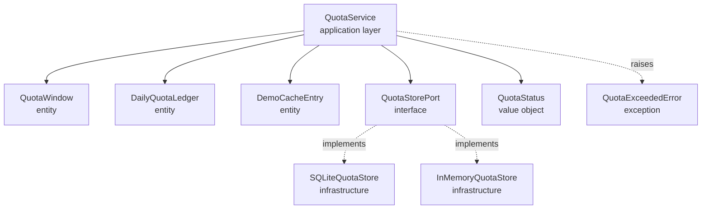

# Data Model: Demo Quota Protection Middleware

**Date**: 2026-02-16  
**Feature**: 006-demo-protection

## Overview

This document defines the domain entities, value objects, and data structures for quota protection. All models follow hexagonal architecture principles: domain models are pure Python with no framework dependencies.

---

## Domain Entities

### 1. QuotaWindow

**Purpose**: Tracks request timestamps for a single IP address over a rolling time window.

**Responsibility**: Determine if another request is allowed within the hourly limit.

**Attributes**:
```python
@dataclass
class QuotaWindow:
    ip_address: str
    request_timestamps: list[datetime]  # Ordered by time (oldest first)
    window_duration_seconds: int = 3600  # Default: 1 hour
    
    def is_within_limit(self, limit: int, current_time: datetime | None = None) -> bool:
        """Check if another request is allowed given the limit."""
        ...
    
    def record_request(self, timestamp: datetime | None = None) -> None:
        """Add a new request timestamp to the window."""
        ...
    
    def prune_old_requests(self, current_time: datetime | None = None) -> None:
        """Remove timestamps outside the rolling window."""
        ...
    
    @property
    def current_count(self) -> int:
        """Number of requests in the current window."""
        return len(self.request_timestamps)
```

**Validation Rules**:
- `ip_address` must be valid IPv4 or IPv6
- `window_duration_seconds` must be > 0
- `request_timestamps` must be in chronological order (enforced internally)

**State Transitions**:
```
[Empty window] 
    → record_request() 
    → [1 request]
    → record_request()
    → [2 requests]
    → ... (up to limit)
    → is_within_limit() returns False when limit reached
    → (time passes)
    → prune_old_requests()
    → [Fewer requests, capacity freed]
```

---

### 2. DailyQuotaLedger

**Purpose**: Represents the global daily usage across all IPs for the current calendar day (UTC).

**Responsibility**: Track daily quota consumption and determine if budget is exhausted.

**Attributes**:
```python
@dataclass
class DailyQuotaLedger:
    date: str  # ISO 8601 date (YYYY-MM-DD)
    used: int  # Queries consumed today
    limit: int  # Configured daily budget
    
    @property
    def remaining(self) -> int:
        """Queries remaining in daily budget."""
        return max(0, self.limit - self.used)
    
    @property
    def percentage_used(self) -> float:
        """Percentage of daily budget consumed (0-100)."""
        return (self.used / self.limit) * 100 if self.limit > 0 else 0.0
    
    @property
    def is_warning(self) -> bool:
        """True if usage >= 80% of limit."""
        return self.percentage_used >= 80.0
    
    @property
    def is_exhausted(self) -> bool:
        """True if usage >= limit."""
        return self.used >= self.limit
    
    def increment(self) -> None:
        """Increment usage by 1 (called after allowing a request)."""
        self.used += 1
    
    def reset(self, new_date: str) -> None:
        """Reset usage for a new day."""
        self.date = new_date
        self.used = 0
```

**Validation Rules**:
- `date` must be valid ISO 8601 date string
- `used` must be >= 0
- `limit` must be > 0
- `used` may temporarily exceed `limit` due to race conditions (acceptable)

**Invariants**:
- `remaining` is always >= 0 (clamped)
- `percentage_used` is always 0-100+ (can exceed 100 if over quota)

---

### 3. DemoCacheEntry

**Purpose**: Represents a pre-cached demo question with its normalized form and pre-computed answer.

**Responsibility**: Enable exact matching of user questions to cached responses.

**Attributes**:
```python
@dataclass
class DemoCacheEntry:
    original_question: str  # Human-readable form (for display)
    normalized_question: str  # Lowercase, no punctuation, collapsed whitespace
    answer: str  # Pre-computed answer text
    subject: str | None = None  # Optional subject tag (e.g., "python", "biology")
    
    @staticmethod
    def normalize(text: str) -> str:
        """Normalize question per FR-006: lowercase, strip punctuation, collapse whitespace."""
        normalized = text.lower()
        normalized = re.sub(r'[^\w\s]', '', normalized)  # Remove punctuation
        normalized = ' '.join(normalized.split())  # Collapse whitespace
        return normalized
    
    @classmethod
    def create(cls, question: str, answer: str, subject: str | None = None) -> "DemoCacheEntry":
        """Factory method to create entry with automatic normalization."""
        return cls(
            original_question=question,
            normalized_question=cls.normalize(question),
            answer=answer,
            subject=subject
        )
    
    def matches(self, user_question: str) -> bool:
        """Check if user question matches this cached entry."""
        return self.normalized_question == self.normalize(user_question)
```

**Example Data**:
```python
demo_cache = [
    DemoCacheEntry.create(
        question="What is async/await in Python?",
        answer="Async/await is Python's syntax for writing asynchronous code...",
        subject="python"
    ),
    DemoCacheEntry.create(
        question="How does RAG work?",
        answer="Retrieval-Augmented Generation (RAG) combines...",
        subject="ai"
    ),
    # ... 8 more demo questions
]
```

---

## Value Objects

### 4. QuotaStatus

**Purpose**: Snapshot of current quota state for status endpoint responses.

**Attributes**:
```python
@dataclass
class QuotaStatus:
    # Daily quota info
    daily_used: int
    daily_limit: int
    daily_remaining: int
    daily_percentage_used: float
    daily_reset_at: str  # ISO 8601 timestamp (next midnight UTC)
    quota_warning: bool  # True if >= 80% used
    
    # Cache info
    cached_questions_count: int
    cache_hit_rate: float  # 0-100 percentage (today's cache hits / total queries)
    
    # Metadata
    current_time: str  # ISO 8601 timestamp
    
    def to_dict(self) -> dict:
        """Serialize to JSON-compatible dict."""
        return {
            "daily": {
                "used": self.daily_used,
                "limit": self.daily_limit,
                "remaining": self.daily_remaining,
                "percentage_used": round(self.daily_percentage_used, 2),
                "reset_at": self.daily_reset_at
            },
            "cache": {
                "questions_count": self.cached_questions_count,
                "hit_rate": round(self.cache_hit_rate, 2)
            },
            "quota_warning": self.quota_warning,
            "timestamp": self.current_time
        }
```

**Example JSON Response**:
```json
{
  "daily": {
    "used": 245,
    "limit": 300,
    "remaining": 55,
    "percentage_used": 81.67,
    "reset_at": "2026-02-17T00:00:00Z"
  },
  "cache": {
    "questions_count": 10,
    "hit_rate": 34.5
  },
  "quota_warning": true,
  "timestamp": "2026-02-16T18:23:45Z"
}
```

---

## Domain Exceptions

### 5. QuotaExceededError

**Purpose**: Raised when a request violates quota limits.

**Hierarchy**:
```python
class QuotaError(Exception):
    """Base exception for quota-related errors."""
    pass

class IPLimitExceededError(QuotaError):
    """Raised when per-IP hourly limit is exceeded."""
    def __init__(self, ip: str, limit: int, retry_after_seconds: int):
        self.ip = ip
        self.limit = limit
        self.retry_after_seconds = retry_after_seconds
        super().__init__(
            f"IP {ip} exceeded hourly limit ({limit} requests/hour). "
            f"Retry after {retry_after_seconds} seconds."
        )

class DailyQuotaExceededError(QuotaError):
    """Raised when global daily budget is exhausted."""
    def __init__(self, used: int, limit: int, reset_at: datetime):
        self.used = used
        self.limit = limit
        self.reset_at = reset_at
        super().__init__(
            f"Daily quota exhausted ({used}/{limit}). "
            f"Resets at {reset_at.isoformat()}."
        )

class QuotaStorageError(QuotaError):
    """Raised when quota storage is unavailable (triggers HTTP 503)."""
    def __init__(self, original_error: Exception):
        self.original_error = original_error
        super().__init__(f"Quota storage unavailable: {original_error}")
```

---

## Port Interfaces (Domain → Infrastructure)

### 6. QuotaStorePort

**Purpose**: Abstract interface for quota persistence (domain doesn't know about SQLite).

**Methods**:
```python
class QuotaStorePort(ABC):
    """Port for quota storage (implemented by infrastructure adapters)."""
    
    @abstractmethod
    async def get_daily_ledger(self) -> DailyQuotaLedger:
        """Fetch current day's quota ledger (creates if not exists)."""
        ...
    
    @abstractmethod
    async def increment_daily_usage(self) -> None:
        """Atomically increment daily usage counter by 1."""
        ...
    
    @abstractmethod
    async def reset_daily_usage(self, new_date: str) -> None:
        """Reset daily usage to 0 for a new day."""
        ...
    
    @abstractmethod
    async def get_cache_hit_count(self) -> int:
        """Get number of cache hits today (for metrics)."""
        ...
    
    @abstractmethod
    async def increment_cache_hit(self) -> None:
        """Record a cache hit (for hit rate calculation)."""
        ...
```

**Implementations** (in infrastructure layer):
- `InMemoryQuotaStore`: Session-based (for testing)
- `SQLiteQuotaStore`: Production persistence

---

## Relationships



**Key Principles**:
1. Domain entities (`QuotaWindow`, `DailyQuotaLedger`, `DemoCacheEntry`) have no external dependencies
2. `QuotaStorePort` defines what the domain needs (infrastructure provides it)
3. Exceptions are domain concepts (business rule violations)
4. Value objects (`QuotaStatus`) are immutable snapshots

---

## Storage Schema (Infrastructure Concern)

**Note**: This is NOT part of the domain model, but documented here for completeness.

**SQLite Table: `daily_quota`**
```sql
CREATE TABLE IF NOT EXISTS daily_quota (
    date TEXT PRIMARY KEY,  -- YYYY-MM-DD
    used INTEGER NOT NULL DEFAULT 0,
    limit INTEGER NOT NULL,
    cache_hits INTEGER NOT NULL DEFAULT 0,
    created_at TEXT NOT NULL,  -- ISO 8601 timestamp
    updated_at TEXT NOT NULL   -- ISO 8601 timestamp
);

CREATE INDEX idx_daily_quota_date ON daily_quota(date);
```

**Why SQLite**:
- Already in dependencies (`aiosqlite>=0.19.0`)
- Zero-cost (local file, no server)
- Sufficient for demo scale (<1000 queries/day)
- ACID transactions ensure atomic updates

---

## Summary

**Domain Entities**: 3 (QuotaWindow, DailyQuotaLedger, DemoCacheEntry)  
**Value Objects**: 1 (QuotaStatus)  
**Exceptions**: 3 (IPLimitExceededError, DailyQuotaExceededError, QuotaStorageError)  
**Ports**: 1 (QuotaStorePort)

**Design Principles Applied**:
- ✅ Domain-Driven Design (entities, value objects, ports)
- ✅ Hexagonal Architecture (domain isolated from infrastructure)
- ✅ Single Responsibility (each entity has one clear purpose)
- ✅ Type Safety (Pydantic-compatible dataclasses)
- ✅ Testability (no external dependencies in domain layer)
