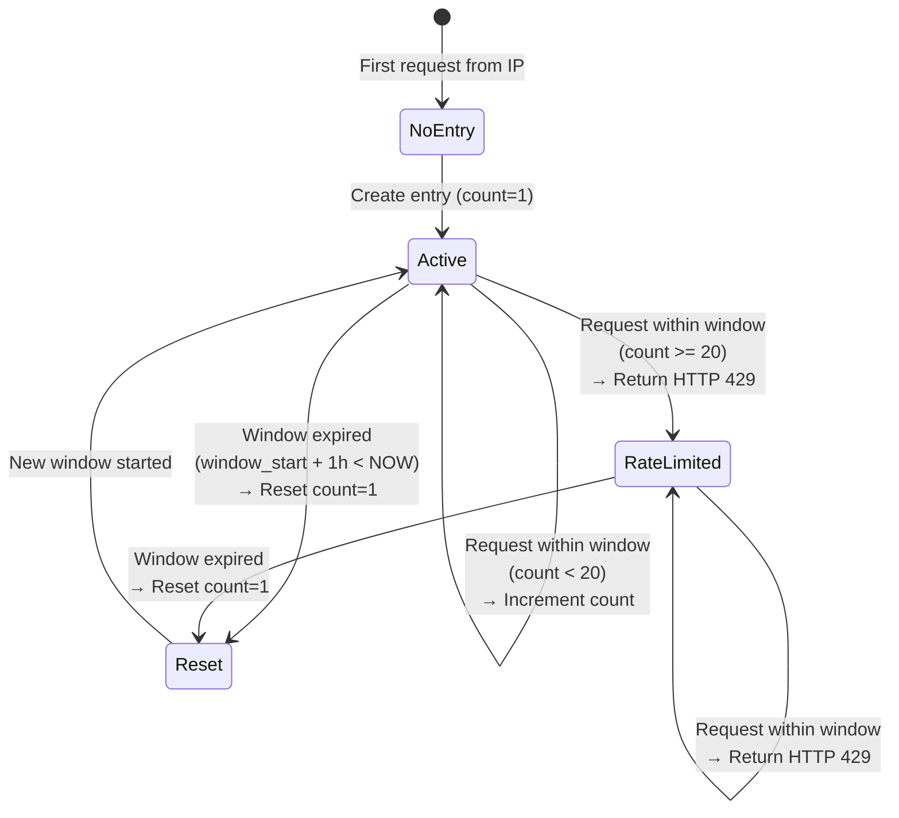

# Data Model: Zeabur Deployment

**Feature**: 008-zeabur-deployment  
**Date**: 2025-02-17  
**Purpose**: Rate limit state persistence for IP-based request tracking

---

## Overview

This feature introduces one new entity for rate limiting: **RateLimitEntry**. All other data models (Query, Document, ConversationHistory) from Feature 001 remain unchanged.

---

## Entity: RateLimitEntry

**Purpose**: Track per-IP request counts within 1-hour rolling window for demo quota protection.

**Storage**: SQLite (`data/courseflow.db`) - persists across container restarts

**Lifecycle**:
1. Created on first request from new IP address
2. Updated (increment counter) on subsequent requests within window
3. Reset (new window) when 1 hour expires since `window_start`
4. Optional cleanup: Delete entries where `last_request > 24 hours ago`

### Fields

| Field Name | Type | Constraints | Description |
|------------|------|-------------|-------------|
| `id` | INTEGER | PRIMARY KEY, AUTOINCREMENT | Unique identifier for rate limit entry |
| `ip_address` | TEXT | NOT NULL, INDEXED | Client IP address (IPv4 or IPv6) |
| `request_count` | INTEGER | NOT NULL, DEFAULT 0 | Number of requests in current window |
| `window_start` | TIMESTAMP | NOT NULL, INDEXED | Start of current 1-hour window (UTC) |
| `last_request` | TIMESTAMP | NOT NULL | Timestamp of most recent request (UTC) |
| `created_at` | TIMESTAMP | DEFAULT CURRENT_TIMESTAMP | First request timestamp (UTC) |

### SQLite Schema

```sql
CREATE TABLE IF NOT EXISTS rate_limits (
    id INTEGER PRIMARY KEY AUTOINCREMENT,
    ip_address TEXT NOT NULL,
    request_count INTEGER NOT NULL DEFAULT 0,
    window_start TIMESTAMP NOT NULL,
    last_request TIMESTAMP NOT NULL,
    created_at TIMESTAMP DEFAULT CURRENT_TIMESTAMP
);

-- Index for fast IP lookup
CREATE INDEX IF NOT EXISTS idx_rate_limits_ip 
ON rate_limits(ip_address);

-- Index for window expiration queries
CREATE INDEX IF NOT EXISTS idx_rate_limits_window 
ON rate_limits(window_start);

-- Optional: Index for cleanup queries
CREATE INDEX IF NOT EXISTS idx_rate_limits_last_request 
ON rate_limits(last_request);
```

### State Transitions



### Validation Rules

1. **IP Address Format**:
   - IPv4: `192.168.1.1`
   - IPv6: `2001:0db8:85a3:0000:0000:8a2e:0370:7334`
   - Extracted from `request.client.host` in FastAPI

2. **Request Count**:
   - Minimum: 0
   - Maximum: 20 (rate limit threshold)
   - Constraint: `request_count >= 0`

3. **Timestamps**:
   - Format: ISO 8601 UTC (`2025-02-17T12:34:56Z`)
   - `window_start` <= `last_request` (window always starts before or at last request)
   - `created_at` <= `window_start` (first window starts after creation)

4. **Window Duration**:
   - Fixed: 1 hour (3600 seconds)
   - Window expired when: `NOW() - window_start > 3600`

### Repository Methods

**Interface**: `RateLimitRepository` (in `src/courseflow/infrastructure/repositories/rate_limit_repo.py`)

```python
from datetime import datetime
from typing import Optional

class RateLimitRepository:
    async def get_by_ip(self, ip: str) -> Optional[dict]:
        """
        Retrieve rate limit entry for given IP address.
        
        Returns:
            dict with keys: id, ip_address, request_count, window_start, last_request, created_at
            None if no entry exists
        """
        pass
    
    async def create_entry(self, ip: str, timestamp: datetime) -> dict:
        """
        Create new rate limit entry for IP address.
        
        Args:
            ip: Client IP address
            timestamp: Current timestamp (UTC)
        
        Returns:
            Created entry dict
        """
        pass
    
    async def increment_counter(self, ip: str, timestamp: datetime) -> None:
        """
        Increment request counter and update last_request timestamp.
        
        Args:
            ip: Client IP address
            timestamp: Current timestamp (UTC)
        """
        pass
    
    async def reset_window(self, ip: str, timestamp: datetime) -> None:
        """
        Reset window for expired entry (new 1-hour window).
        
        Args:
            ip: Client IP address
            timestamp: Current timestamp (new window_start)
        """
        pass
    
    async def cleanup_old_entries(self, cutoff: datetime) -> int:
        """
        Delete entries older than cutoff timestamp.
        
        Args:
            cutoff: Delete entries where last_request < cutoff
        
        Returns:
            Number of deleted entries
        """
        pass
```

### Example Data

**Active Entry (Within Limit)**:
```json
{
  "id": 1,
  "ip_address": "203.0.113.42",
  "request_count": 15,
  "window_start": "2025-02-17T12:00:00Z",
  "last_request": "2025-02-17T12:45:30Z",
  "created_at": "2025-02-17T10:30:00Z"
}
```

**Rate Limited Entry**:
```json
{
  "id": 2,
  "ip_address": "198.51.100.23",
  "request_count": 20,
  "window_start": "2025-02-17T11:00:00Z",
  "last_request": "2025-02-17T11:55:00Z",
  "created_at": "2025-02-17T11:00:00Z"
}
```

**Expired Entry (Ready for Reset)**:
```json
{
  "id": 3,
  "ip_address": "192.0.2.100",
  "request_count": 8,
  "window_start": "2025-02-17T09:00:00Z",
  "last_request": "2025-02-17T09:30:00Z",
  "created_at": "2025-02-17T08:00:00Z"
}
```
_Window expired: NOW (2025-02-17T12:00:00Z) - window_start (09:00:00Z) > 1 hour_

---

## Relationships

**RateLimitEntry** is independent of other entities:
- No foreign keys to User (no authentication in demo)
- No foreign keys to Query (rate limit applies to all endpoints)
- No foreign keys to ConversationHistory

**Cardinality**:
- One IP address → One RateLimitEntry (1:1, enforced by query logic, not FK)

---

## Database Migration

### Initial Migration (Feature 008)

**File**: `backend/migrations/008_add_rate_limits.sql`

```sql
-- Migration: Add rate_limits table for Feature 008
-- Date: 2025-02-17

CREATE TABLE IF NOT EXISTS rate_limits (
    id INTEGER PRIMARY KEY AUTOINCREMENT,
    ip_address TEXT NOT NULL,
    request_count INTEGER NOT NULL DEFAULT 0,
    window_start TIMESTAMP NOT NULL,
    last_request TIMESTAMP NOT NULL,
    created_at TIMESTAMP DEFAULT CURRENT_TIMESTAMP
);

CREATE INDEX IF NOT EXISTS idx_rate_limits_ip ON rate_limits(ip_address);
CREATE INDEX IF NOT EXISTS idx_rate_limits_window ON rate_limits(window_start);
CREATE INDEX IF NOT EXISTS idx_rate_limits_last_request ON rate_limits(last_request);
```

**Migration Script** (Python):
```python
import aiosqlite

async def run_migration():
    async with aiosqlite.connect('data/courseflow.db') as conn:
        with open('migrations/008_add_rate_limits.sql', 'r') as f:
            migration_sql = f.read()
        
        await conn.executescript(migration_sql)
        await conn.commit()
    
    print("✅ Migration 008: rate_limits table created")

if __name__ == "__main__":
    import asyncio
    asyncio.run(run_migration())
```

### Rollback Plan

If rate limiting must be disabled:
1. Remove rate limit middleware from FastAPI app
2. Optionally drop table: `DROP TABLE IF EXISTS rate_limits;`
3. Redeploy backend

**No data loss risk**: Rate limit data is ephemeral (can be recreated on next request).

---

## Performance Considerations

### Query Performance

**Indexed Queries** (Fast):
- Lookup by IP: `SELECT * FROM rate_limits WHERE ip_address = ?` (uses `idx_rate_limits_ip`)
- Cleanup: `DELETE FROM rate_limits WHERE last_request < ?` (uses `idx_rate_limits_last_request`)

**Expected Performance**:
- IP lookup: <1ms (indexed, <1000 entries expected)
- Increment update: <1ms (single row update)
- Cleanup query: <10ms (scans `last_request` index)

### Storage Size

**Per Entry**: ~100 bytes (5 fields × ~20 bytes each)

**Expected Size**:
- 100 unique IPs/day × 30 days = 3000 entries
- 3000 entries × 100 bytes = 300KB
- **Total**: <1MB storage impact

### Concurrency

**SQLite Write Locking**:
- SQLite allows only one writer at a time
- Rate limit checks are fast (<1ms), minimal lock contention expected
- For <10 concurrent users (demo scope), no performance issues

**Future Optimization** (if needed):
- Switch to PostgreSQL for better concurrent write performance
- Use Redis for sub-millisecond rate limit checks

---

## Testing Requirements

### Unit Tests

1. **Repository Tests** (`tests/unit/test_rate_limit_repo.py`):
   - `test_create_entry()` - Verify entry creation with correct fields
   - `test_get_by_ip_existing()` - Retrieve existing entry
   - `test_get_by_ip_nonexistent()` - Return None for new IP
   - `test_increment_counter()` - Verify count increments and last_request updates
   - `test_reset_window()` - Verify count resets to 1 and window_start updates
   - `test_cleanup_old_entries()` - Verify deletion of entries older than cutoff

2. **State Transition Tests** (`tests/unit/test_rate_limit_states.py`):
   - `test_first_request()` - NoEntry → Active transition
   - `test_within_limit()` - Active → Active (increment)
   - `test_limit_reached()` - Active → RateLimited (count = 20)
   - `test_window_expired()` - RateLimited → Reset (new window)

### Integration Tests

1. **Middleware Tests** (`tests/integration/test_rate_limit_middleware.py`):
   - `test_20_requests_succeed()` - 20 consecutive requests from same IP return HTTP 200
   - `test_21st_request_blocked()` - 21st request returns HTTP 429 with retry_after header
   - `test_window_reset_after_1_hour()` - Request after 1 hour succeeds (new window)
   - `test_different_ips_independent()` - 2 different IPs have separate counters

2. **Persistence Tests** (`tests/integration/test_rate_limit_persistence.py`):
   - `test_counter_survives_restart()` - Stop/start app, verify counter persists (SC-009)

---

## Security Considerations

### IP Spoofing

**Risk**: Client could spoof IP address in headers (e.g., `X-Forwarded-For`)

**Mitigation**: Use `request.client.host` (FastAPI's socket-level IP), not headers

**Trade-off**: Behind reverse proxy, all requests appear from proxy IP; acceptable for single-instance demo

### DDoS Protection

**Risk**: Attacker could exhaust rate limit from many IPs

**Mitigation**: 
- Rate limiting reduces impact (20 req/hour per IP)
- Zeabur Free Trial has bandwidth limits (natural throttling)

**Trade-off**: No advanced DDoS protection (WAF, IP blacklisting); acceptable for demo

### Privacy

**Risk**: IP addresses are personally identifiable information (PII)

**Mitigation**:
- IP addresses stored short-term (optional 24h cleanup)
- No user accounts or personal data linked to IPs

**Trade-off**: Storing raw IPs (not hashed); acceptable for demo

---

## Future Enhancements (Out of Scope)

1. **Per-User Rate Limiting**: Replace IP-based with authenticated user rate limits
2. **Redis Backend**: Switch to Redis for distributed rate limiting (multi-instance support)
3. **Dynamic Rate Limits**: Admin API to adjust limits per user/IP
4. **Rate Limit Bypass**: Whitelist IPs (e.g., admin, monitoring)
5. **Sliding Window**: More accurate rate limiting (vs fixed 1-hour window)

---

**Data Model Status**: ✅ COMPLETE
