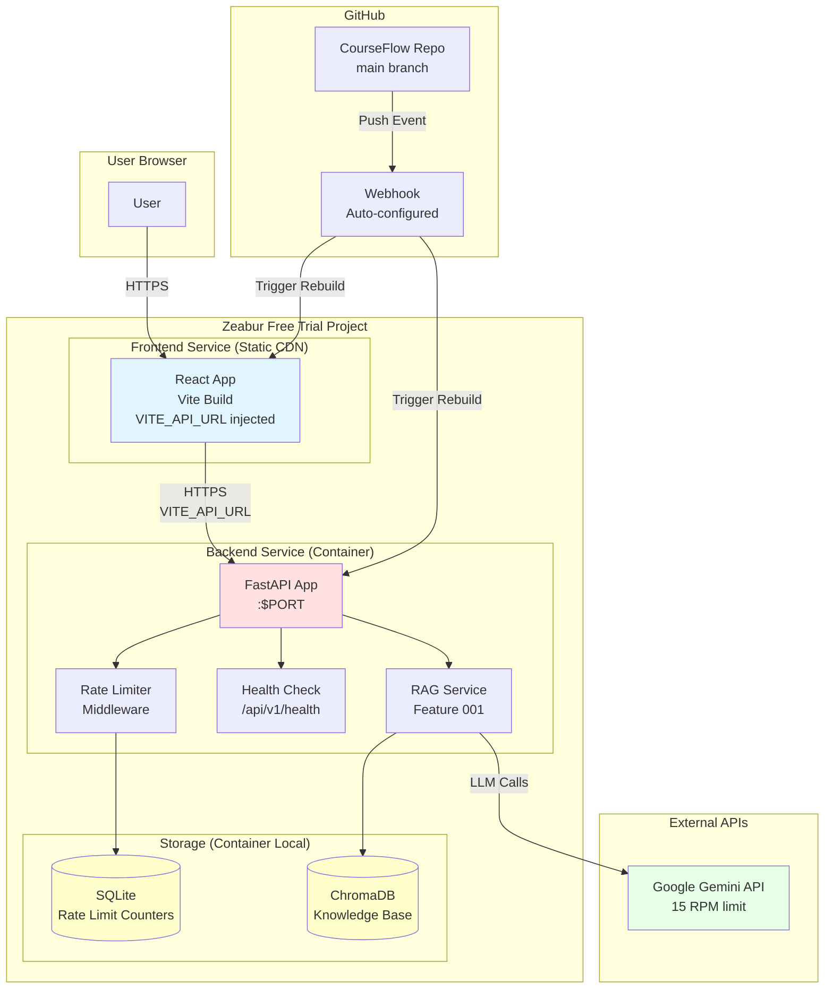
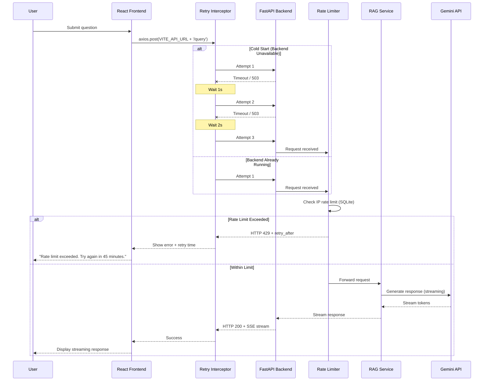

# Implementation Plan: Zeabur Deployment

**Branch**: `008-zeabur-deployment` | **Date**: 2025-02-17 | **Spec**: [specs/008-zeabur-deployment/spec.md](./spec.md)
**Input**: Feature specification from `/specs/008-zeabur-deployment/spec.md`

## Summary

Deploy CourseFlow (FastAPI backend + React frontend) to Zeabur Free Trial with auto-redeploy on git push, enabling live demo for internship interviews. Technical approach: containerized backend with rate limiting (SQLite persistence), static frontend with build-time VITE_API_URL injection, frontend retry logic for cold start handling, and GitHub webhook auto-configuration by Zeabur.

## Technical Context

**Language/Version**: Python 3.11 (backend), Node.js 18+ (frontend build)
**Primary Dependencies**: 
- Backend: FastAPI 0.109+, uvicorn, ChromaDB 0.4.22+, aiosqlite, google-generativeai
- Frontend: React 18, Vite 5, axios (with retry interceptor)

**Storage**: 
- SQLite (rate limit counters, conversation history) - persists across restarts
- ChromaDB (vector database) - committed to repo at `data/chroma/`
- Frontend static assets - served via Zeabur CDN

**Testing**: pytest + pytest-asyncio (backend), Vitest (frontend unit), Playwright (E2E)

**Target Platform**: 
- Backend: Zeabur containerized service (512MB RAM, 1 vCPU)
- Frontend: Zeabur static site hosting (CDN)

**Project Type**: Web application (backend + frontend)

**Performance Goals**:
- Frontend load: <3s (P95)
- Health check: <1s response time
- E2E query: <8s (submission → first token)
- Auto-redeploy: <5 minutes total

**Constraints**:
- 512MB memory per service (Zeabur Free Trial limit)
- 1 vCPU per service (no horizontal scaling)
- 2GB ephemeral storage (ChromaDB must fit)
- 15 RPM Gemini API limit (enforced by backend rate limiting)
- Zero-cost deployment (Free Trial $5 credit only)

**Scale/Scope**: 
- Single-user demo (interviewer access)
- <10 concurrent users
- No SLA guarantee (free tier)
- 30-day interview period lifespan

## Constitution Check

*GATE: Must pass before Phase 0 research. Re-check after Phase 1 design.*

**Code Quality**: 
- [x] Feature complexity justified (deployment config files <100 lines, retry logic <50 lines)
- [x] Documentation strategy defined (README deployment section, Zeabur dashboard guide, API health check docs)
- [x] Code review process established (PR review for all deployment config changes)

**Testing Standards**:
- [x] Test strategy defined:
  - Unit: Rate limiter logic, retry interceptor logic
  - Integration: Health check endpoint, rate limit middleware
  - E2E: Full deployment test (frontend → backend query), cold start retry test
- [x] Coverage targets identified (80% for rate limiter, 100% for retry logic - critical path)
- [x] Test-first approach planned (rate limiter tests before implementation)

**AI Engineering Standards**:
- [x] Rate limiting enforces Gemini 15 RPM limit (20 req/hour = ~0.33 RPM, well under limit)
- [x] Token tracking preserved (existing logging remains intact)
- [x] Error handling enhanced (frontend retry logic with exponential backoff)
- [x] Graceful degradation (retry exhaustion shows user-friendly error)

**Performance Requirements**:
- [x] Performance targets defined (SC-001 through SC-009 in spec)
- [x] Cold start handling strategy planned (frontend retry logic, 3 attempts with backoff)
- [x] Database query strategy N/A (no new queries, SQLite rate limit storage uses indexed lookups)
- [x] Asset optimization planned (Vite build minification, tree-shaking enabled)

**Zero-Cost Constraints**:
- [x] Zeabur Free Trial only ($0/month + $5 credit)
- [x] No paid cloud services (AWS, GCP, Azure)
- [x] Local ChromaDB (no hosted vector DB)
- [x] SQLite local (no hosted PostgreSQL)
- [x] Gemini free tier (15 RPM, 1500 req/day)

**User Experience (API-First)**:
- [x] Error responses actionable (HTTP 429 with retry_after, 503 with backend unavailable message)
- [x] Loading states handled (frontend spinner during retry attempts)
- [x] Health check endpoint documented (`/api/v1/health`)

## Project Structure

### Documentation (this feature)

```text
specs/008-zeabur-deployment/
├── plan.md              # This file
├── research.md          # Phase 0 output (dependency versions, Zeabur best practices)
├── data-model.md        # Phase 1 output (rate limit state schema)
├── quickstart.md        # Phase 1 output (deployment guide)
├── contracts/           # Phase 1 output (health check API contract)
└── tasks.md             # Phase 2 output (generated by /speckit.tasks)
```

### Source Code (repository root)

```text
backend/
├── src/courseflow/
│   ├── api/
│   │   ├── main.py                  # CORS origins, PORT binding
│   │   ├── routes/
│   │   │   └── health.py            # NEW: Health check endpoint
│   │   └── middleware/
│   │       └── rate_limit.py        # NEW: Rate limiter middleware
│   ├── infrastructure/
│   │   └── repositories/
│   │       └── rate_limit_repo.py   # NEW: SQLite rate limit storage
│   └── config.py                    # CORS_ORIGINS env var
├── zeabur.json                      # NEW: Zeabur backend config
├── Dockerfile                       # MODIFIED: PORT binding
└── requirements.txt                 # No new dependencies

frontend/
├── src/
│   ├── services/
│   │   └── api.ts                   # MODIFIED: Axios retry interceptor
│   └── config/
│       └── env.ts                   # NEW: VITE_API_URL reader
├── zeabur.json                      # NEW: Zeabur frontend config
├── vite.config.ts                   # MODIFIED: Env var injection
└── .env.production.example          # NEW: Template for VITE_API_URL

.github/
└── workflows/
    └── zeabur-deploy.yml            # OPTIONAL: Manual trigger workflow (Zeabur auto-deploys)

docs/
└── deployment/
    ├── zeabur-setup.md              # NEW: Account setup, project creation
    ├── environment-variables.md     # NEW: Required env vars list
    └── troubleshooting.md           # NEW: Common issues + solutions
```

**Structure Decision**: Web application structure (backend + frontend) with deployment configuration at repo root. Health check, rate limiter, and retry logic are new components. Existing RAG pipeline (Feature 001) and React frontend (Feature 007) remain unchanged except for CORS and retry interceptor additions.

## Complexity Tracking

> **No violations requiring justification**

All components meet constitution standards:
- Rate limiter middleware: <50 lines (simple IP-based counter)
- Retry interceptor: <50 lines (exponential backoff logic)
- Health check endpoint: <30 lines (component status check)
- Deployment configs: <100 lines each (JSON configuration files)

---

## Phase 0: Outline & Research

**Goal**: Resolve all NEEDS CLARIFICATION from Technical Context and research best practices for Zeabur deployment.

### Research Tasks

1. **Zeabur Deployment Best Practices**
   - Task: Research Zeabur Free Trial service limits and deployment configuration format
   - Questions to answer:
     - What is the exact format for `zeabur.json`?
     - How does Zeabur handle PORT environment variable binding?
     - What are the build timeout limits?
     - How is GitHub webhook auto-configured?
   - Sources: Zeabur documentation, existing examples

2. **Frontend Build-Time Environment Variables**
   - Task: Verify Vite build-time env var injection pattern (VITE_API_URL)
   - Questions to answer:
     - How to inject `VITE_API_URL` during `npm run build`?
     - How to support separate dev/prod builds?
     - How to read injected variable in React components?
   - Sources: Vite documentation, environment variable best practices

3. **Rate Limiting with SQLite**
   - Task: Research SQLite-based rate limiter patterns for FastAPI
   - Questions to answer:
     - Schema design for IP-based rate limit counters?
     - How to handle counter expiration (1-hour window)?
     - Async SQLite query patterns with aiosqlite?
   - Sources: FastAPI middleware examples, SQLite datetime handling

4. **Frontend Retry Logic Patterns**
   - Task: Research axios retry interceptor patterns with exponential backoff
   - Questions to answer:
     - How to implement exponential backoff (1s, 2s, 4s)?
     - How to detect cold start vs permanent failure?
     - How to display retry progress to user?
   - Sources: axios-retry library (evaluate if needed), custom interceptor examples

5. **ChromaDB in Containerized Environment**
   - Task: Verify ChromaDB persistence in Zeabur container environment
   - Questions to answer:
     - Does ChromaDB `data/chroma/` persist across container restarts?
     - What is the size of the committed ChromaDB data?
     - Are there any file permission issues in containerized deployment?
   - Sources: ChromaDB documentation, Zeabur persistent storage guide

6. **Health Check Best Practices**
   - Task: Research FastAPI health check endpoint patterns
   - Questions to answer:
     - What should health check verify? (DB connection, ChromaDB, Gemini API reachability?)
     - Should health check be authenticated?
     - What HTTP status codes for partial degradation?
   - Sources: FastAPI health check examples, microservices health check patterns

### Research Output Structure

**File**: `research.md`

For each research task:
- **Decision**: [Selected approach]
- **Rationale**: [Why this approach chosen]
- **Alternatives considered**: [Other options evaluated]
- **Dependency versions**: [Resolved via investigation]
- **Trade-offs**: [Accepted limitations]

---

## Phase 1: Design & Contracts

**Prerequisites**: `research.md` complete

**ARCHITECTURE REVIEW REQUIRED**: Invoke `senior-architect` skill before generating designs.

### 1. System Architecture Diagram

**Deployment Topology** (Mermaid):



### 2. Component Interaction Flow

**Frontend → Backend Query Flow** (Sequence Diagram):



### 3. Rate Limit State Persistence Design

**File**: `data-model.md`

**Entity: RateLimitEntry**

| Field | Type | Description | Constraints |
|-------|------|-------------|-------------|
| id | INTEGER | Primary key | AUTOINCREMENT |
| ip_address | TEXT | Client IP address | NOT NULL, INDEXED |
| request_count | INTEGER | Number of requests in current window | DEFAULT 0 |
| window_start | TIMESTAMP | Start of current 1-hour window | NOT NULL |
| last_request | TIMESTAMP | Timestamp of most recent request | NOT NULL |
| created_at | TIMESTAMP | First request timestamp | DEFAULT CURRENT_TIMESTAMP |

**SQLite Schema**:
```sql
CREATE TABLE IF NOT EXISTS rate_limits (
    id INTEGER PRIMARY KEY AUTOINCREMENT,
    ip_address TEXT NOT NULL,
    request_count INTEGER DEFAULT 0,
    window_start TIMESTAMP NOT NULL,
    last_request TIMESTAMP NOT NULL,
    created_at TIMESTAMP DEFAULT CURRENT_TIMESTAMP
);

CREATE INDEX idx_rate_limits_ip ON rate_limits(ip_address);
CREATE INDEX idx_rate_limits_window ON rate_limits(window_start);
```

**State Transitions**:
1. **First Request**: Create entry with `request_count=1`, `window_start=NOW()`
2. **Subsequent Request (Same Window)**: Increment `request_count`, update `last_request`
3. **Window Expired**: Reset `request_count=1`, update `window_start=NOW()`
4. **Limit Exceeded**: Return HTTP 429, do not increment counter

**Cleanup Strategy**: 
- Delete entries where `last_request < NOW() - 24 hours` (periodic cleanup job)
- Alternatively: No cleanup (entries remain, reset on next request after window expires)

### 4. Cold Start Retry Flow

**Frontend Retry Logic** (Pseudocode):

```typescript
// src/services/api.ts
const axiosInstance = axios.create({
  baseURL: import.meta.env.VITE_API_URL,
  timeout: 10000, // 10s timeout
});

// Retry interceptor with exponential backoff
axiosInstance.interceptors.response.use(
  (response) => response,
  async (error) => {
    const config = error.config;
    
    // Initialize retry count
    if (!config._retryCount) {
      config._retryCount = 0;
    }
    
    // Max 3 retries
    if (config._retryCount >= 3) {
      return Promise.reject(error);
    }
    
    // Retry on timeout or 503 (backend unavailable)
    const shouldRetry = 
      error.code === 'ECONNABORTED' || 
      error.response?.status === 503;
    
    if (shouldRetry) {
      config._retryCount++;
      
      // Exponential backoff: 1s, 2s, 4s
      const delay = Math.pow(2, config._retryCount - 1) * 1000;
      
      await new Promise(resolve => setTimeout(resolve, delay));
      
      return axiosInstance(config);
    }
    
    return Promise.reject(error);
  }
);
```

**Flow Diagram**:

```
┌─────────────────┐
│ User submits    │
│ question        │
└────────┬────────┘
         │
         ▼
┌─────────────────┐
│ Attempt 1       │
│ timeout=10s     │
└────────┬────────┘
         │
    ┌────┴────┐
    │Timeout? │
    └────┬────┘
         │ Yes
         │ Wait 1s
         ▼
┌─────────────────┐
│ Attempt 2       │
│ timeout=10s     │
└────────┬────────┘
         │
    ┌────┴────┐
    │Timeout? │
    └────┬────┘
         │ Yes
         │ Wait 2s
         ▼
┌─────────────────┐
│ Attempt 3       │
│ timeout=10s     │
└────────┬────────┘
         │
    ┌────┴────┐
    │Success? │
    └────┬────┘
         │ No
         ▼
┌─────────────────┐
│ Show error:     │
│ "Backend        │
│ unavailable"    │
└─────────────────┘
```

### 5. API Contracts

**File**: `contracts/health-check.yaml` (OpenAPI 3.0)

```yaml
openapi: 3.0.3
info:
  title: CourseFlow Health Check API
  version: 1.0.0
  description: Health check endpoint for deployment verification

servers:
  - url: https://courseflow-api.zeabur.app/api/v1
    description: Production (Zeabur)
  - url: http://localhost:8000/api/v1
    description: Local development

paths:
  /health:
    get:
      summary: Health check endpoint
      description: Returns system health status without authentication
      operationId: getHealth
      responses:
        '200':
          description: Service is healthy
          content:
            application/json:
              schema:
                $ref: '#/components/schemas/HealthResponse'
              examples:
                healthy:
                  value:
                    status: "healthy"
                    timestamp: "2025-02-17T12:34:56Z"
                    components:
                      database: "ok"
                      vector_store: "ok"
                      llm_api: "ok"
        '503':
          description: Service is degraded or unavailable
          content:
            application/json:
              schema:
                $ref: '#/components/schemas/HealthResponse'
              examples:
                degraded:
                  value:
                    status: "degraded"
                    timestamp: "2025-02-17T12:34:56Z"
                    components:
                      database: "ok"
                      vector_store: "ok"
                      llm_api: "unavailable"

components:
  schemas:
    HealthResponse:
      type: object
      required:
        - status
        - timestamp
      properties:
        status:
          type: string
          enum: [healthy, degraded, unavailable]
          description: Overall system health status
        timestamp:
          type: string
          format: date-time
          description: ISO 8601 timestamp of health check
        components:
          type: object
          description: Individual component health status
          properties:
            database:
              type: string
              enum: [ok, unavailable]
            vector_store:
              type: string
              enum: [ok, unavailable]
            llm_api:
              type: string
              enum: [ok, unavailable]
```

### 6. Quickstart Guide

**File**: `quickstart.md`

```markdown
# Zeabur Deployment Quickstart

## Prerequisites

- Zeabur Free Trial account
- GitHub account with CourseFlow repository access
- Gemini API key (free tier)

## Step 1: Create Zeabur Project

1. Log in to [Zeabur Dashboard](https://zeabur.com)
2. Click "New Project" → Name: `courseflow-demo`
3. Select "Free Trial" plan ($5 credit)

## Step 2: Deploy Backend Service

1. In project, click "Add Service" → "Git Repository"
2. Select `CourseFlow` repository → Branch: `main`
3. Service name: `courseflow-backend`
4. Root directory: `/backend`
5. Build command: `pip install -r requirements.txt`
6. Start command: `uvicorn src.courseflow.api.main:app --host 0.0.0.0 --port $PORT`

### Environment Variables (Backend)

Add in Zeabur dashboard:
```
GEMINI_API_KEY=<your-api-key>
CORS_ORIGINS=https://courseflow.zeabur.app,http://localhost:5173
RATE_LIMIT_PER_HOUR=20
DATABASE_URL=sqlite:///./data/courseflow.db
CHROMA_PERSIST_DIR=./data/chroma
```

## Step 3: Deploy Frontend Service

1. In same project, click "Add Service" → "Git Repository"
2. Select `CourseFlow` repository → Branch: `main`
3. Service name: `courseflow-frontend`
4. Root directory: `/frontend`
5. Build command: `npm install && npm run build`
6. Output directory: `dist`

### Environment Variables (Frontend)

Add in Zeabur dashboard:
```
VITE_API_URL=https://courseflow-backend.zeabur.app
```

**Important**: Copy exact backend URL from Zeabur dashboard.

## Step 4: Configure Auto-Deploy

Zeabur automatically configures GitHub webhook when repository is linked.

Verify webhook:
1. GitHub repo → Settings → Webhooks
2. Webhook URL should contain `zeabur.com`
3. Events: `push` to `main` branch

## Step 5: Verify Deployment

### Test Health Check
```bash
curl https://courseflow-backend.zeabur.app/api/v1/health
```

Expected response:
```json
{
  "status": "healthy",
  "timestamp": "2025-02-17T12:34:56Z",
  "components": {
    "database": "ok",
    "vector_store": "ok",
    "llm_api": "ok"
  }
}
```

### Test Frontend
1. Open `https://courseflow-frontend.zeabur.app` in browser
2. Submit test question: "What is async/await in Python?"
3. Verify streaming response appears

### Test Rate Limit
Submit 21 consecutive requests from same IP:
- Requests 1-20: HTTP 200
- Request 21: HTTP 429 with `retry_after` header

## Troubleshooting

See [troubleshooting.md](../../docs/deployment/troubleshooting.md) for common issues.
```

### 7. Agent Context Update

**Task**: Run `.specify/scripts/powershell/update-agent-context.ps1 -AgentType copilot`

**Technologies to Add**:
- Zeabur (platform-as-a-service)
- Zeabur Free Trial (deployment tier)
- VITE_API_URL (environment variable pattern)
- axios retry interceptor (frontend pattern)
- SQLite rate limiting (backend pattern)

---

## Phase 1 Completion: Memory Persistence

**Key to write**: `plan:decisions`

```json
{
  "session_date": "2025-02-17",
  "branch": "008-zeabur-deployment",
  "architectural_style": "Hexagonal Architecture (existing) + Deployment Infrastructure",
  "tech_stack": {
    "deployment_platform": {
      "technology": "Zeabur",
      "version": "Free Trial"
    },
    "backend_runtime": {
      "technology": "uvicorn",
      "version": "0.27.0+"
    },
    "frontend_build": {
      "technology": "Vite",
      "version": "5.0.0+"
    },
    "rate_limiter_storage": {
      "technology": "SQLite",
      "version": "3.37.0+"
    },
    "retry_library": {
      "technology": "axios",
      "version": "1.6.0+ (custom interceptor)"
    }
  },
  "key_decisions": [
    {
      "area": "deployment",
      "decision": "Separate backend and frontend services on Zeabur",
      "rationale": "Static CDN for frontend = faster load times; containerized backend = PORT flexibility"
    },
    {
      "area": "frontend_config",
      "decision": "VITE_API_URL build-time injection",
      "rationale": "Supports dev/prod environment separation without code changes"
    },
    {
      "area": "rate_limiting",
      "decision": "Backend middleware with SQLite persistence",
      "rationale": "Survives container restarts; simple IP-based tracking; no external dependencies"
    },
    {
      "area": "cold_start",
      "decision": "Frontend retry logic with exponential backoff (1s, 2s, 4s)",
      "rationale": "Handles up to 7s backend startup delay; graceful UX degradation"
    },
    {
      "area": "observability",
      "decision": "Zeabur dashboard logs only",
      "rationale": "Sufficient for demo troubleshooting; zero-cost constraint maintained"
    }
  ],
  "constitution_violations_resolved": [],
  "artifacts_generated": [
    "plan.md",
    "research.md",
    "data-model.md",
    "contracts/health-check.yaml",
    "quickstart.md"
  ]
}
```

---

## Implementation Tasks Preview

**Note**: Detailed tasks generated by `/speckit.tasks` command in Phase 2.

**High-level task groups** (dependency-ordered):

1. **Phase 0: Research & Documentation** (parallel)
   - Research Zeabur deployment patterns
   - Research Vite env var injection
   - Research SQLite rate limiting
   - Research axios retry patterns
   - Document findings in research.md

2. **Phase 1: Backend Deployment Infrastructure** (sequential)
   - Create `zeabur.json` for backend
   - Add health check endpoint (`/api/v1/health`)
   - Implement rate limiter middleware
   - Create rate limit SQLite repository
   - Update CORS configuration for production URLs
   - Modify Dockerfile for PORT binding

3. **Phase 2: Frontend Deployment Infrastructure** (sequential)
   - Create `zeabur.json` for frontend
   - Add VITE_API_URL environment variable support
   - Implement axios retry interceptor
   - Update Vite config for env var injection
   - Create `.env.production.example`

4. **Phase 3: Testing & Validation** (parallel subtasks)
   - Unit tests: Rate limiter logic
   - Unit tests: Retry interceptor logic
   - Integration tests: Health check endpoint
   - Integration tests: Rate limit middleware
   - E2E test: Cold start retry flow
   - E2E test: Full query flow (frontend → backend)

5. **Phase 4: Deployment & Verification** (sequential)
   - Deploy backend to Zeabur
   - Deploy frontend to Zeabur
   - Verify health check (SC-002)
   - Verify frontend load time (SC-001)
   - Verify E2E query (SC-003)
   - Verify rate limiting (SC-004)
   - Verify auto-redeploy (SC-005)
   - Verify cold start handling (SC-006)
   - Verify rate limit persistence (SC-009)

---

## Success Verification Plan

All success criteria from spec (`SC-001` through `SC-009`) must be validated before feature completion.

| Criterion | Test Method | Acceptance |
|-----------|-------------|------------|
| SC-001: Frontend load <3s | Browser DevTools Network tab | P95 <3s |
| SC-002: Health check <1s | `curl -w "%{time_total}" /api/v1/health` | <1s |
| SC-003: E2E query <8s | Frontend timer (submission → first token) | <8s |
| SC-004: Rate limit active | Submit 21 requests, verify 21st = HTTP 429 | HTTP 429 returned |
| SC-005: Auto-redeploy <5min | Push commit, measure GitHub push → new version live | <5min |
| SC-006: Cold start handling | Idle 30min, submit query, verify retry success | Success or error <12s |
| SC-007: URLs accessible 30 days | Daily uptime check (manual) | 30-day availability |
| SC-008: No CORS errors | Browser console during query submission | Zero CORS errors |
| SC-009: Rate limit persistence | Redeploy backend, verify counter state preserved | Counter persists |

---

## Dependencies

**Internal Dependencies** (MUST be complete):
- ✅ Feature 001: RAG QA System (backend with FastAPI + ChromaDB)
- ✅ Feature 007: React Frontend MVP (query submission UI)

**External Dependencies** (MUST be available):
- Zeabur Free Trial account
- GitHub repository access
- Gemini API key (free tier, 15 RPM)

**Dependency Resolution**:
- All internal dependencies met (Features 001 and 007 complete per spec)
- External dependencies: User responsible for account setup (documented in quickstart.md)

---

## Risk Analysis

| Risk | Impact | Probability | Mitigation |
|------|--------|-------------|------------|
| Zeabur Free Trial quota exhausted | Deployment unavailable | Low | Monitor $5 credit usage, upgrade if needed |
| ChromaDB size exceeds 2GB | Container startup fails | Low | Current knowledge base <100MB, well within limit |
| Cold start >7s (retry exhaustion) | User sees error message | Medium | Document as known limitation, acceptable for demo |
| Gemini API quota exceeded | HTTP 429 from backend | Medium | Rate limiter enforces 20 req/hour, stays under 15 RPM |
| GitHub webhook misconfiguration | Auto-deploy fails | Low | Zeabur auto-configures webhook, verify in GitHub settings |

---

## Next Steps

After this plan is reviewed and approved:

1. Execute Phase 0 research (populate `research.md`)
2. Execute Phase 1 design (generate all design artifacts)
3. Run `/speckit.tasks` to generate detailed implementation tasks (`tasks.md`)
4. Run `/speckit.implement` to execute tasks in dependency order

---

**Plan Status**: ✅ COMPLETE (Phase 0 and Phase 1 planning complete; ready for task generation)
